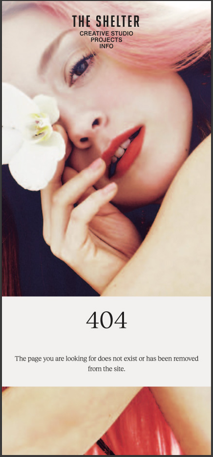
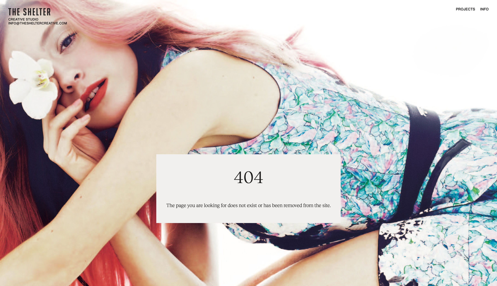
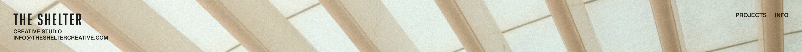
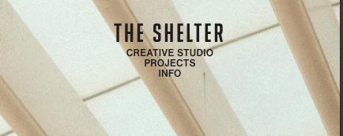
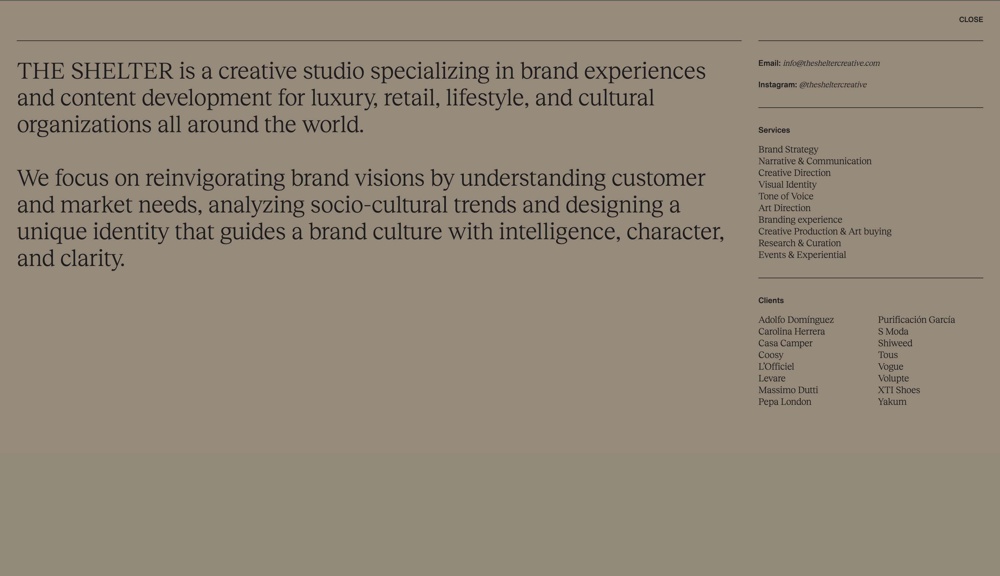
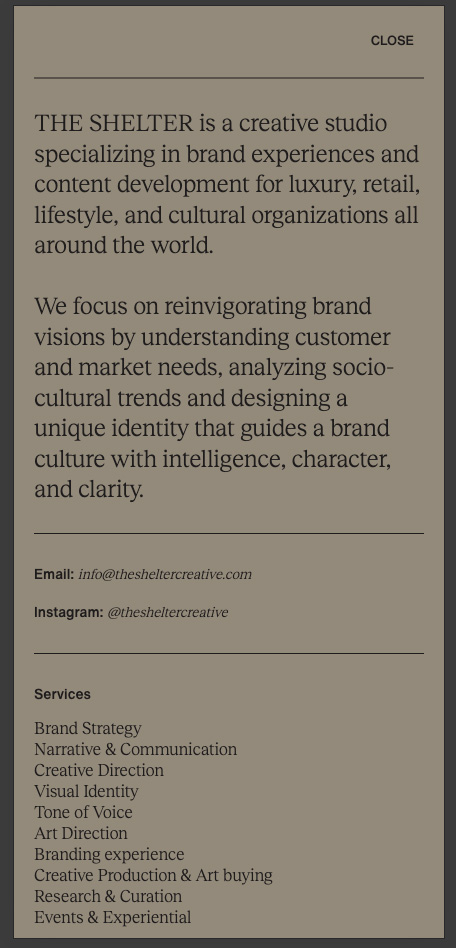
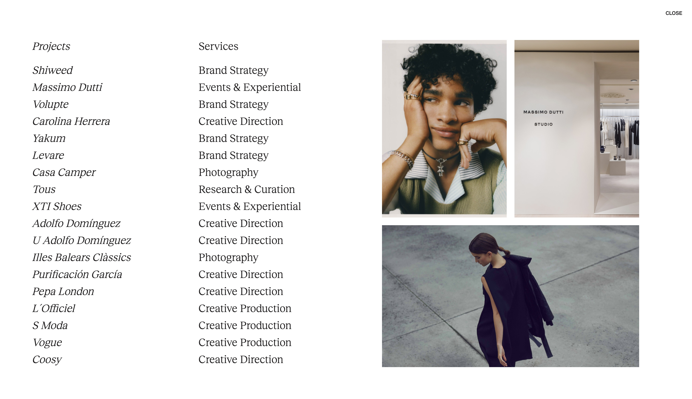
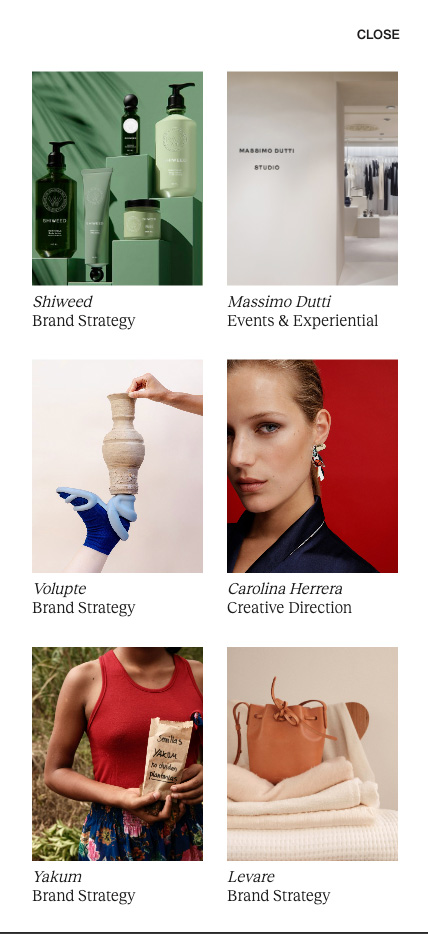

## Role **: Full-Stack Developer  
**Responsibilities**:
- Design of the front-end for mobile and desktop using Figma.
- Development the front-end.
- Development of the back-end template database using Django.
- Image Curation & image optimization including editing and resizing images. 
- Deployment
- SEO implementation 

## Scope

### Business Goals

 The main objective of the website is to highlight the client's work and boost engagement in order to attract potential future business opportunities.
 This is to be achieved by:

- A design and website personality that reflects the clients values and appeals to the target demographic.
As the business is involved in branding, a strong empahsis was put on the visual elements of the website and also influnced functionality.

- The presentation of the clients previous work. The showcasing and curation of images and videos were of primary importance.
- A website that is easy and intuitive to navigate.
- The ability for users to access essential information such as, contact information, services offered, and past projects.

- Incorporating SEO features into the website.

A secondary goal is to increase engagement expand the clients network and scope in the industry. 

### Target Audience

- Brands and clients in various industries, including fashion, retail, beauty, travel, and luxury lifestyle.
- People working in creative production, photography, branding, fashion, visual media and content creation.

### User Experience - Requirements and Expectations
- A user-friendly website that balances information with an aesthetic that is appealing and modern.
- A mobile-friendly website
- A way to view the clients work.
- Information about the clients business.
- A way to make contact.
- A way to easily access social media accounts from the website.

### General User Needs
1. As a user, I can intuitively navigate through the website so that I can easily access key information and view desired content.
2. As a user, I can find essential information about the company, such as: services offered, contact info & social media links.
3. As a user, I can view the clients work clearly.
3. As a user, I can see a list of the clients past projects.
4. As a user, I can explore each project further and see services offered, project description and releated images and videos.

## Front-End Design

Given the company's expertise in branding, the website's design and functionality were meticulously crafted with visual communication as a primary driver. 
Every design element was intentionally selected to create a cohesive, compelling narrative that resonates with the target audience and showcases the company's creative capabilities.

### Brief
- A design communicates the brand value and appeals to the target audience.
- A website personality and tone that is neutral, bold, confident, modern and that quitely reflects luxury and sophistication.
- A website that is easy to navigate and locate necessary information for optimal user experience.

### Execution

#### UX 

- Full-Page Scrolling was decided on to be used as the scrolling pattern and is a core element of the website.
- This was implemented using Fullpage.js. 
- This provides an immersive and curated experience allowing users to focus on one image at a time minimising distractions from surrounding content and traditional scrolling. 
- This turned out particularly effective in showcasing the clients work which primarialy deals in photography, branding and creative production.

#### Images & Videos

- As images are the primary content of the website much care was given them.
- Art direction was implemented using the <picture> element to provide multiple versions of an image for different screen sizes and in controlling the exact crop of an image. 

#### Templates

- A selection of templates were created to faciliate image selection and variety. 
- These included various image grids and full screen arrangments.
- This provided a fast was to upload the projects to the webite and prevented repetition. 
- These grids were uploaded to the website database, when the could be further cusomiised for each section if needed.

#### Header & Logo Design

#### Primary Colours & Background Colours
Two colors were selected for the text elements:
- The default text color is an off-black (#1E1C1C), which is applied to all text elements throughout the website.
- An off-white (#F2F0EF) is used for text elements that appear over dark images and videos, ensuring optimal legibility and contrast.

- A colour gradient chart was used to generate shades between the two primary colours. These were used for hover and background colours.

TEXT PRIMARY COLOR (OFF-BLACK): #1E1C1C;
TEXT PRIMARY COLOR HOVER : #626060;

TEXT SECONDARY COLOR (OFF-WHITE): #F2F0EF
TEXT SECONDARY COLOR HOVER : #E0E0E0 (light), #C0C0C0 (dark)

#### Styling Colours

#### Typography Selection

The typography choices for the website were carefully considered to align with the brief of creating a modern yet refined and luxurious tone.

 [Big Noodle Too](https://www.myfonts.com/collections/big-noodle-too-font-sentinel-type?gad_source=1&gclid=Cj0KCQiA_9u5BhCUARIsABbMSPspweB8dLDucMRA3ii2S5-KCBvfQFYDur-5oPWZg2d6gYnDGusHoKUaApQXEALw_wcB) from myfonts.com is used on the logo. The client had already used this font before for the company logo.
 

Sans-serif for Headings and Navigation: 
[Helvetica Now ](https://www.myfonts.com/collections/helvetica-now-variable-font-monotype-imaging?gad_source=1&gclid=Cj0KCQiA_9u5BhCUARIsABbMSPt9lteUZbeU0eapbzvWRKqirrfeP-TPfpJa1AQDZUr3y596Hq5TbyIaAqzbEALw_wcB) from myfonts.com, was selected for headings and navigation elements in the header. This modern update of the classic Helvetica offers improved legibility and a fresh aesthetic, perfectly complementing the website's contemporary design12. 

[Reckless Neue Book ](https://displaay.net/typeface/reckless-collection/reckless-neue/) from Displaay Type Foundry, was chosen for the primary body text. Its elevated x-height enhances readability while imparting a contemporary and refined feel, aligning well with the desired website personality3.

This combination of sans-serif for headings and serif for body text creates a balanced visual hierarchy, marrying modern design sensibilities with a touch of classic elegance. The contrast between the two typefaces adds visual interest while maintaining a cohesive and sophisticated overall appearance.

## Features

### 404 Error Page

 

A custom 404 page was implemented to handle and site errors.
 

### Landing Page

#### Key Objectives and Features:
- Capture user attention & generate intrigue to encourage further exploration of the website.
- Foster an emotional connection with the user.
- Aligne with the overall brand identity, including color schemes and style. 
 
The decision to leave out common features of a landing page such as a CTA button and text
 was made to preserve tone and personality.

 

### Logo Design

#### Key Objectives and Features:
- Display the company's name prominently
- Maintain brand continuity
- Create a modern and sophisticated visual identity
- Ensure versatility across various applications

#### Execution
- Typography: After thorough consultations with the client regarding typography options, we ultimately decided to retain the original font, Big Noodle Too, in all uppercase. This choice honors the company's heritage, as it has been in use since the brand's inception. The selected font aligns perfectly with the overall tone and aesthetic of the website, providing a seamless visual experience.

- Sub-logo: To enhance the logo's impact, I proposed the addition of a sub-logo specifically for the website, to be placed beneath the main company logo. For the sub-logo, we chose Helvetica Now, a contemporary serif font that complements the primary logo while adding a fresh, modern touch. This combination creates a unique visual hierarchy, blending the refined sophistication of the main logo with the modern industrial feel of the sub-logo.

The contrast between the two typefaces adds depth and interest to the overall design, making it more memorable and visually appealing. The final logo design successfully balances tradition with innovation, creating a distinctive and versatile visual identity that effectively represents the company's brand across all platforms. It acts as a stamping mark on all pages of the website, reinforcing brand recognition and leaving a lasting impression on visitors.

#### Key Objectives and Features:

### Header

#### Key Objectives and Features:
- Provide navigation links to the info and projects modal pages.
- Showcase brand identity through strategic logo placement
- Develop a distinctive, non-conventional header design therfore not using templates.
- Maintain visual hierarchy that prioritizes main content of the page

#### Execution
The header design deliberately deviated from conventional layouts by positioning the logo at the extreme left and navigation elements to the right. This unconventional approach achieved multiple design objectives:
- Bold Visual Statement: The asymmetrical layout creates a striking, original composition that immediately communicates the website's innovative and creative personality.
- Visual Hierarchy: The sparse, minimalist design allows imagery to become the focal point, drawing users' attention to the core visual content.
- Functional Elegance: Despite its unconventional placement, the navigation remains intuitive and easily accessible, balancing aesthetic innovation with user experience.

The strategic header design reflects a thoughtful approach to layout, where form follows function while simultaneously making a bold visual statement that aligns with the website's contemporary and refined aesthetic.

The header is implemented as an absolute element and, using fullpage.js anchoring, allows for easy colour transitionss between sections.

 

### Info modal

#### Key Objectives and Features:
- Comprehensive Company Overview: Offers concise yet informative details about the company's mission, values, and core competencies.
- Display essential information including: social media profile links, contact information, service offerings and a client roster.

#### Execution

The website features a unique approach to presenting essential information through an info modal, accessible via the header's info link. This design choice reimagines the traditional footer and about section, consolidating them into a single, easily accessible interface.

- Intergration of a customised Bootstrap 4 modal.
- A custom layout was designed for the info page, keeping the 'about' text to the left and the essential information to the right in a column. This design creates a clean, refined, and easily legible layout that maintains visual hierarchy while achieving a balanced, asymmetric composition.

#### Enhanced User Experience:
- Always readily available, eliminating the need for scrolling to access a footer
- Provides a fresh, intriguing alternative to conventional website layouts
- Efficient Information Architecture: Streamlines the user's journey to key information, improving overall site navigation and engagement

### Projects Modal

#### Key Objectives and Features:
##### Comprehensive Project List:
- Presents all projects in a clear, visually appealing manner
- Each project entry acts as a clickable link for further exploration
- Displays the client company name and primary service provided

#####  Dynamic Visual Representation:
- Assigns a unique, representative image to each project
- Implements an innovative image display system:
Default view: Shows a collage of three project images
Interactive feature: On hover, the display transitions to showcase the specific project's image

#####  Responsive Design:
- Desktop: Utilizes the dynamic image container for an interactive experience
- Mobile: Adapts layout to accommodate smaller screens while maintaining individual project images

#####  Enhanced User Experience:
- Provides visual context for each project, aiding in quick recognition and interest generation
- Offers an intuitive, engaging way to browse through the company's work
- Encourages exploration by combining textual information with visual elements

#####  Efficient Information Architecture:
- Consolidates project information in a single, easily accessible location
- Streamlines the user's journey from curiosity to detailed project exploration

The Info Modal, accessible via the header's info link, serves as an innovative project showcase, offering users an engaging and interactive way to explore the company's portfolio.

### Home Page

As users scroll beyond the landing page, the rest of the homepage offers a gallery-like experience through one-page scrolling, showcasing a selection of the client's portfolio that includes both images and videos. This seamless journey loops back to the landing page at the end, creating a cohesive browsing experience.

#### Key Objectives and Features:
##### 
- Visually Engaging Presentation: Displays all projects in a clear and captivating manner, drawing users in.
- Foster Interest: Provides a glimpse into the company’s work, enticing users to explore projects in greater detail.
- Contextual Information: Each project includes relevant details about the company name and primary services associated with the image or video.
- Insight into Operations: The slides section offers information about the company’s working methods and processes.

##### Tailored Presentation:
- Each section is presented using different templates that complements the content.

#####  Responsive Design:
- Performance Optimization: Utilizes the <picture> element to improve loading times and support art direction.
- Responsive Templates: Ensures that layouts adapt seamlessly to various screen sizes.

#####  Enhanced User Experience:
- Immersive Scrolling: The full-page scrolling design provides users with an immersive, curated experience that allows them to fully appreciate the media content.
- Encouragement for Exploration: Combines textual information with visual elements to motivate further site exploration.

#####  Efficient Information Architecture:
- Streamlined Navigation: Simplifies the user's journey through the content, increasing curiosity and engagement.

This thoughtfully designed homepage not only showcases the client’s portfolio effectively but also enhances user interaction and satisfaction, making it a compelling entry point for visitors.

