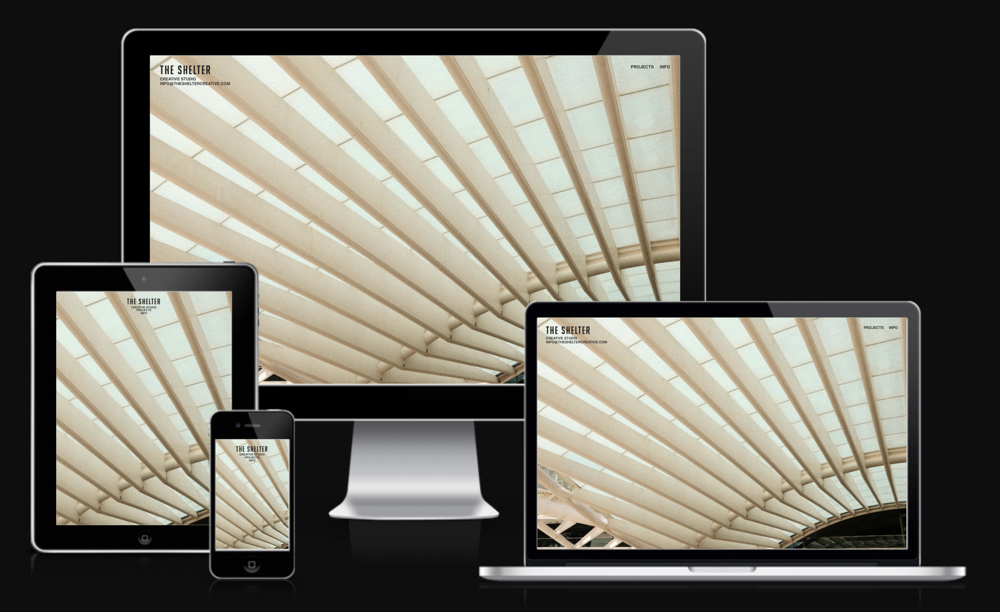
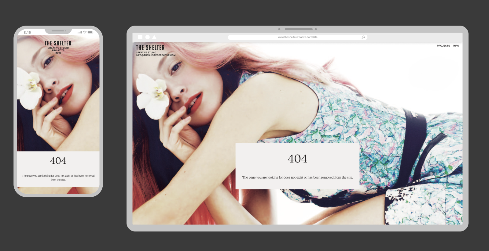
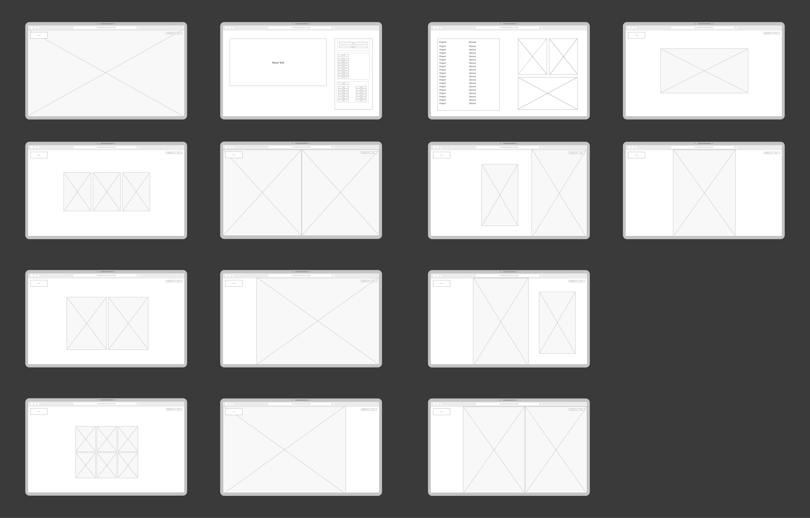

# The Shelter Creative

## <a href="https://www.thesheltercreative.com" target="_blank">Live Site</a>

# Table Of Content

## Table of Contents

1. [Introduction](#introduction)
2. [Scope](#scope)
3. [UX](#ux)
4. [Front End Design](#front-end-design)
5. [Features](#features)
6. [Design Development Process](#design-development-process)
7. [Back End Design](#back-end-design)
8. [SEO](#seo)
9. [Testing](#testing)
10. [Bugs and Fixes](#bugs-and-fixes)
11. [Deployment](#deployment)
12. [Technology Used](#technology-used)
13. [Further Possible Additions](#further-possible-additions)
 
 

# Introduction

The website serves as a comprehensive platform to showcase the creative expertise and the diverse services provided by The Shelter Creative, a creative agency based in Madrid. The site features a modern, user-centric design that effectively integrates multimedia elements, including high-quality images and engaging videos. This approach not only captivates visitors but also highlights the agency's impressive portfolio, allowing potential clients to appreciate the breadth and depth of its work.
The website is designed with the user experience in mind, ensuring that navigation is intuitive and content is easily accessible. The Shelter Creative aims to create an immersive online experience that reflects its innovative spirit and commitment to excellence in the creative industry.

## Role: Full-Stack Developer  
**Responsibilities**:
- Design of the front-end for mobile and desktop using Figma
- Development the front-end: HTML, CSS, Javascript
- Design and development of the back-end template database using Django Python Framework
- Image Curation & image optimization
- Deployment
- SEO implementation
 
 

# Scope

## Business Goals

The main objective of the website is to highlight the company's work and boost engagement in order to attract potential future business opportunities. This is to be achieved by:
- A design and website personality that reflects the company's values and appeals to the target demographic. As the business is involved in branding, a strong emphasis was placed on the visual elements of the website, which also influenced its functionality.
- The presentation of the client's previous work. The showcasing and curation of images and videos are of primary importance.
- A website that is easy and intuitive to navigate.
- The ability for users to access essential information such as contact information, services offered, and past projects.
- Incorporating SEO features into the website.

A secondary goal is to increase engagement by expanding the client's network and scope within the industry.

## Target Audience

The target audience for The Shelter Creative includes:
- Brands and Clients Across Various Industries: This encompasses sectors such as fashion, retail, beauty, travel, and luxury lifestyle. These brands seek creative solutions that enhance their visibility and resonate with their target markets.
- Creative Professionals: Individuals working in creative production, photography, branding, fashion, visual media, and content creation form another crucial segment. They often require specialized services that align with their artistic vision and professional needs.

This diverse audience reflects the agency's commitment to serving a wide range of clients, providing tailored creative strategies that meet the unique demands of different industries.

# UX 

## UX Requirements and Expectations
The website is designed to meet the following user experience requirements and expectations:
- **Intuitive Design**: A user-friendly website that strategically balances comprehensive information with a modern, visually appealing aesthetic.
- **Responsive Design**: A mobile-friendly website that ensures seamless navigation and optimal viewing across various devices and screen sizes.
- **Portfolio Showcase**: A clear and engaging method to view the client's work, highlighting their creative portfolio and demonstrating their professional capabilities.
- **Business Insights**: Comprehensive information about the client's business, including services, expertise, and unique value proposition.
- **Contact Accessibility**: A straightforward and prominent contact mechanism that enables potential clients to easily reach out and initiate communication.
- **Social Media Integration**: Simple and direct access to the client's social media accounts, facilitating broader engagement and connection across digital platforms.

These requirements are designed to create an engaging, informative, and user-centric digital experience that effectively communicates the client's brand identity and professional offerings.

## General User Needs

1. As a user, I can intuitively navigate through the website so that I can easily access key information and view desired content.
2. As a user, I can find essential information about the company, such as services offered, contact information, and social media links.
3. As a user, I can view the client's work clearly.
4. As a user, I can see a list of the client's past projects.
5. As a user, I can explore each project further and see services offered, project descriptions, and related images and videos.

These user stories effectively capture the core functionality and user expectations for the website. They focus on key aspects such as navigation, information accessibility, portfolio presentation, and detailed project exploration. These stories serve as a solid foundation for designing and developing a user-centred website that meets the needs of The Shelter Creative's target audience.

## UX Implementation

### Full-Page Scrolling

Full-Page Scrolling was chosen as the scrolling pattern and is a core element of the website. This was implemented using [FullPage.js](https://alvarotrigo.com/fullPage/), which provides an immersive, curated experience. It allows users to focus on one image at a time, avoiding the typical scrolling pattern that can cut off images or content. By minimising distractions from surrounding elements, this method enhances the visual impact of each image.

This approach was particularly effective in showcasing the client's work, which primarily deals with photography, branding, and creative production. The full-page scrolling experience not only avoids the traditional scrolling interruptions but also creates a loop on the homepage and project pages, offering a seamless, continuous flow for users as they explore the site content.

### Enhanced User Experience

- Open Graph (OG) meta tags improve social media sharing by providing rich previews with accurate titles, descriptions, and images when the site is shared on platforms like Facebook or LinkedIn.
- Favicon implementation across various devices and sizes enhances brand recognition and improves the site's visual appearance in browser tabs and bookmarks.
- Font preloading optimizes page load times by prioritizing the loading of critical fonts, reducing layout shifts, and improving perceived performance.
- The manifest file enhances the user experience by providing a more app-like feel to the website and improving its integration with mobile devices.
 
 

# Front End Design

Given the company's expertise in branding, the website's design and functionality were meticulously crafted with visual communication as a primary driver. 
Every design element was intentionally selected to create a cohesive, compelling narrative that resonates with the target audience and showcases the company's creative capabilities.

## Brief
- Brand Value Communication: The design effectively communicates the brand's value proposition and appeals directly to the target audience, reinforcing The Shelter Creative's position in the market.
- Distinctive Website Personality: The website embodies a personality and tone that is:
    - Neutral, allowing the work to speak for itself
    - Bold, reflecting confidence in the company's capabilities
    - Modern, demonstrating contemporary design sensibilities
    - Quietly luxurious, subtly conveying sophistication without ostentation
    - A website that is easy to navigate and locate necessary information for optimal user experience.

## Implementation

### Images & Videos
- As images are the primary content of the website, much care was given to them.
- Art direction was implemented using the `<picture>` element to provide multiple versions of an image for different screen sizes and to control the exact crop of an image.

### Templates
- A selection of templates was created to facilitate image selection and variety. These included various image grids and full-screen arrangements.
- This provided a fast way to upload the projects to the website and prevented repetition. These grids were uploaded to the website database, where they could be further customised for each section if needed.

### Text Colours & Background Colours
- Pure white (#FFFFFF) is utilised as the main background colour.
- The info modal, as well as the favicon and open graph image, utilise (#948A7A) as a background colour. This muted, warm grey-brown offers good legibility, making it an ideal choice.
- The default text colour is an off-black (#1E1C1C), which is applied to all text elements throughout the website.
- An off-white (#F2F0EF) is used for text elements that appear over dark images and videos, ensuring optimal legibility and contrast.  
A colour gradient chart was used to generate shades for hover colour.

### Typography Selection

The typography choices for the website were carefully considered to align with the brief of creating a modern yet refined tone.

 - [Big Noodle Too](https://www.myfonts.com/collections/big-noodle-too-font-sentinel-type?gad_source=1&gclid=Cj0KCQiA_9u5BhCUARIsABbMSPspweB8dLDucMRA3ii2S5-KCBvfQFYDur-5oPWZg2d6gYnDGusHoKUaApQXEALw_wcB)  is used on the logo. The client had already used this font before for the company logo.

- Sans-serif for Headings and Navigation: 
[Helvetica Now ](https://www.myfonts.com/collections/helvetica-now-variable-font-monotype-imaging?gad_source=1&gclid=Cj0KCQiA_9u5BhCUARIsABbMSPt9lteUZbeU0eapbzvWRKqirrfeP-TPfpJa1AQDZUr3y596Hq5TbyIaAqzbEALw_wcB) from myfonts.com was selected for headings and navigation elements in the header. This modern update of the classic Helvetica offers improved legibility and a fresh aesthetic, perfectly complementing the website's contemporary design.

- [Reckless Neue Book ](https://displaay.net/typeface/reckless-collection/reckless-neue/) from Displaay Type Foundry was chosen for the primary body text. Its elevated x-height enhances readability while imparting a contemporary and refined feel, aligning well with the desired website personality.

This combination of sans-serif for headings and serif for body text creates a balanced visual hierarchy, marrying modern design sensibilities with a touch of classic elegance. The contrast between the two typefaces adds visual interest while maintaining a cohesive and sophisticated overall appearance.

 
 

# Features

## 404 Error Page

A custom 404 page was implemented to handle and site errors.
 

## Logo

### Key Objectives and Features:
- Display the company's name prominently
- Maintain brand continuity
- Create a modern and sophisticated visual identity
- Ensure versatility across various applications

### Execution
- Typography: After thorough consultations with the client regarding typography options, we ultimately decided to retain the original font, Big Noodle Too, in all uppercase. This choice honours the company's heritage, as it has been in use since the brand's inception. The selected font aligns perfectly with the overall tone and aesthetic of the website, providing a seamless visual experience.

- Sub-logo: To enhance the logo's impact, I proposed the addition of a sub-logo specifically for the website, to be placed beneath the main company logo. For the sub-logo Helvetica Now, a contemporary sans-serif font that complements the primary logo while adding a fresh modern touch, was chosen. This combination creates a unique visual hierarchy, blending the refined sophistication of the main logo with the modern industrial feel of the sub-logo.

The contrast between the two typefaces adds depth and interest to the overall design, making it more memorable and visually appealing. The final logo design successfully balances tradition with innovation, creating a distinctive and versatile visual identity that effectively represents the company's brand across all platforms. It acts as a stamping mark on all pages of the website, reinforcing brand recognition and leaving a lasting impression on visitors.

## Landing Page

### Key Objectives and Features:
- Capture user attention and generate intrigue to encourage further exploration of the website.
- Foster an emotional connection with the user.
- Align with the overall brand identity, including colour schemes and style.

### Execution
- An appropriate image was selected to accomplish the necessary criteria.
- The decision was made to omit common features of a landing page, such as a CTA (Call-to-Action) button and text, in order to preserve the desired tone and personality.

## Header

### Key Objectives and Features:
- Provide navigation links to the info and projects modal pages.
- Showcase brand identity through strategic logo placement.
- Impact: Develop a distinctive, non-conventional header design, therefore not using standard templates.
- Maintain visual hierarchy that prioritises the main content of the page.

### Execution
The header design deliberately deviated from conventional layouts by positioning the logo at the extreme left and navigation elements to the right. This unconventional approach achieved multiple design objectives:
- Bold Visual Statement: The asymmetrical layout creates a striking, original composition that immediately communicates the website's innovative and creative personality.
- Visual Hierarchy: The sparse, minimalist design allows imagery to become the focal point, drawing users' attention to the core visual content.
- Functional Elegance: Despite its unconventional placement, the navigation remains intuitive and easily accessible, balancing aesthetic innovation with user experience.
- The header is implemented as an absolute element and, using fullpage.js anchoring, allows for easy colour transitions between sections.

The strategic header design reflects a thoughtful approach to layout, where form follows function while simultaneously making a bold visual statement that aligns with the website's contemporary and refined aesthetic.

## Info Modal

The website features a unique approach to presenting essential information through an info modal, accessible via the header's info link. This design choice reimagines the traditional footer and about section, consolidating them into a single, easily accessible interface.

### Key Objectives and Features:
- Comprehensive Company Overview: Offers concise yet informative details about the company's mission, values, and core competencies.
- Displays essential information including social media profile links, contact information, service offerings, and a client roster.

### Execution

- Integration of a customised Bootstrap 4 modal.
- A custom layout was designed for the info page, keeping the 'about' text to the left and the essential information to the right in a column. This design creates a clean, refined, and easily legible layout that maintains visual hierarchy while achieving a balanced, asymmetric composition.

### User Experience:
- Always readily available, eliminating the need for scrolling to access a footer.
- Provides a fresh, intriguing alternative to conventional website layouts.
- Efficient Information Architecture: Streamlines the user's journey to key information, improving overall site navigation and engagement.

## Projects Modal
The website features access to the company's past work via the header's projects link.

### Key Objectives and Features:
- Present all projects in a clear, visually appealing manner
- Each project entry acts as a clickable link for further exploration
- Display the client company's name and the primary service provided

### Execution
- Integration of a customised Bootstrap 4 modal.
- A custom layout was designed for the projects modal.
- Dynamic Visual Representation: The desktop layout consists of two columns, with the left column containing scrollable links to each project, and the right column displaying a dynamic image container that shows a collage of three project images. This is replaced by a project image when the project link is hovered on. This is implemented using a custom JavaScript script.
- Responsive Design: On mobile, the project list is displayed in one column, with each link shown as a 4:5 aspect image featuring the project name and service.

### User Experience:
- Provides visual context for each project, aiding in quick recognition and generating interest, while streamlining the user's journey from curiosity to detailed project exploration.
- Offers an intuitive, organised, and engaging way to browse through the company's work.
- Encourages exploration by combining textual information with visual elements.

## Home Page

As users scroll beyond the landing page, the rest of the homepage offers a gallery-like experience through one-page scrolling, showcasing a selection of the client's portfolio that includes both images and videos. This seamless journey loops back to the landing page at the end, creating a cohesive browsing experience.

### Key Objectives and Features:
- Foster interest by providing a visually engaging presentation of a selection of the company's work.
- Provide context about each section, with the project name and main service visible.
- A section that offers insight into the way the company works.

### Execution
- Templates were created to allow images to be presented in a variety of ways. Then, with the client, it was decided which images to use for the homepage and in what configuration.
- Section 3 on the homepage consists of three slides with text and acts as an insight into the company's processes.
- Responsive Design: The `<picture>` element was used to ensure that layouts adapt seamlessly to various screen sizes and to control art direction.

### Enhanced User Experience:
- Immersive Scrolling: The full-page scrolling design provides users with an immersive, curated experience that allows them to fully appreciate the media content.
- Encouragement for Exploration: Combines textual information with visual elements to motivate further site exploration.

This thoughtfully designed homepage not only showcases the client’s portfolio effectively but also enhances user interaction and satisfaction, making it a compelling entry point for visitors.

### Home Page

### Individual Project Page

### Key Objectives and Features:
- Showcase each project in comprehensive detail
- Provide in-depth descriptions of the work involved in each project
- Display a diverse range of media to fully represent project scope and outcomes

### Execution
- Developed versatile templates to accommodate various image presentation styles, enabling flexible and dynamic visual storytelling for each project
- Collaborated closely with the client to curate and arrange images, ensuring optimal representation of each project on its dedicated page
- Implemented a consistent structure across project pages, with Section 2 dedicated to outlining the company's services and detailed work descriptions, providing visitors with a clear understanding of the project's scope and the company's expertise
- Incorporated a flexible text section with an accompanying image, allowing for more extensive project narratives when needed, thus enhancing the depth of information available to visitors

This approach ensures that each project page serves as a comprehensive portfolio piece, offering visitors a thorough understanding of the project's challenges, solutions, and outcomes, while maintaining a visually appealing and user-friendly layout.

### Sample of a Project Page

 
 

# Design Development Process

## Wireframes: Creating low-fidelity sketches or digital outlines of the user interface
- The wireframing process began with creating low-fidelity sketches in Figma to outline the basic structure of the homepage and project pages. Since these pages featured a carousel of single-page scrolling sections, it was crucial to develop a set of versatile templates that could accommodate various image configurations.
 

- Wireframes served as the foundation for the design, focusing on layout, navigation, and information architecture without the distraction of visual details. This approach allowed for quick iterations and easy communication of core functionalities to stakeholders.

## Mockup Creation: Developing high-fidelity visual representations of the design in Figma

- Building upon the wireframes, a set of reusable mockup templates were created in Figma. These high-fidelity mockups incorporated more detailed design elements, including placeholder images, typography, and color schemes. The use of templates streamlined the design process, allowing for rapid previews and iterations with the client.
 

- This stage was crucial for visualising different image configurations and making quick adjustments based on client feedback. Figma's collaborative features facilitated real-time editing and commenting, enhancing the iterative design process.

## Final Mockup: Producing the polished, client-approved design ready for development

- The final mock-up stage involved refining the designs based on client feedback and approval. During this phase, the focus was on perfecting visual details, ensuring consistency across all pages, and preparing the designs for seamless development.
 

- For the project pages, special attention was given to highlighting each project's unique features, while maintaining a cohesive overall design. The homepage was crafted to offer an engaging introduction to the portfolio, striking a balance between aesthetics and functionality.  
Additional elements, including modals and favicons, were also finalised, ensuring a polished and professional user experience throughout the site.

### Figma Project Pages

### Figma Homepage

### Figma Modals, 404 & Favicon

 
 

# Back-End Design

## Database Models

This database is a comprehensive Django project management system designed to create flexible, multi-section project pages with robust content management capabilities. It consists of five core models.

### Service Model

The Service model is a foundational component that catalogues all available services. Its structure allows for connection to each project instance in two ways: 
- As a main service (ForeignKey in the Project model)
- As secondary services (ManyToMany relationship in the Project model)

### Template Model
The Template model serves as a repository for reusable section layouts. Each template includes:
- A unique name for easy identification
- HTML content defining the structure
- Optional CSS content for styling
- A description to aid in template selection  
This model promotes consistency across project pages while allowing for customisation when needed.

### Project Model
The Project model is the core entity, containing essential project information:
- Company name
- A unique slug for URL generation
- Main service (ForeignKey to Service model)
- Secondary services (ManyToMany relationship with Service model)
- List position for ordering projects in the Projects Modal
- An optional image for list display in the Projects Modal  

This model effectively organises key project details and establishes relationships with services.

### Project Page Model
The ProjectPage model acts as an aggregator, bringing together up to ten sections for a comprehensive project presentation. It:
- Links to a specific project
- Contains references to multiple Section instances (up to 10)
- Provides a method to generate a unique URL for each project page

### Section Model
This comprehensive model encapsulates all the essential content required to construct a dynamic and customisable section for a project page quickly.  
Its structure includes:
- Template Integration: It incorporates a reference to a pre-defined template from the template model, offering a foundation for consistent design.
- Custom Styling Options: For enhanced flexibility, the model allows for the inclusion of custom HTML and CSS, enabling unique section designs when needed.
- Content Management: Includes all the media and texts needed, including a video file field and multiple image fields, including tablet and mobile sizes.
- Colour Customisation Functionality: Includes options to modify the colour of the company-service text and header text of each section on various screen sizes.

The Section model is a highly flexible component for building project pages. It includes:
- Reference to a specific project
- Option to use a predefined template or custom HTML/CSS
- Fields for project descriptions (if text is needed in the section)
- Customisable colour options for header and text elements, with responsive design support
- Capability to include up to seven images with descriptions, each with tablet and mobile versions
- An optional video field  

This model allows for rich, quick, custom content creation for each project section.

### get_unique_image_name (function)  
Generates unique names for images uploaded to Cloudinary by using the project's company name and slug. All images contain the company's name and the client/project the images relate to. This saves time when uploading images, ensures consistent file names, and improves SEO.

### get_project_image_upload_to (function)  
Determines the upload path for project images in Cloudinary, creating folders dynamically based on the project's slug. If no slug exists, it defaults to a standard folder.  
These functions facilitate effective asset management in Cloudinary by organising images into relevant folders and ensuring that file names are unique, preventing overwrites during uploads.

## Logic
The `views.py` file in the projects app contains the code to process the back-end data and connect it to the front-end.

### get_section_css(section):  
This function retrieves the custom CSS for a section, either from a custom property or from the associated template.

### get_section_html_content(section):  
This function generates the HTML content for a section. It replaces placeholders like image URLs, descriptions, video URLs, and text descriptions with actual data from the section or project. The content includes dynamic fields such as project descriptions and associated services.

### change_color(section, page_position, section_css) and change_text_color(section, page_position, section_css):  
These functions modify the CSS styles for specific section elements, such as header colours or text colour, depending on user-defined settings for desktop, tablet, and mobile views.

### Main View Function (project):

This function processes a single project page identified by the `project_slug`. It retrieves the corresponding Project and ProjectPage objects.  
It then checks each section (from section_1 to section_10) of the project page. If a section exists, the corresponding HTML content and CSS are generated and processed for any colour changes.  
The sections' content and CSS are stored in variables, which are passed to the template for rendering.  
The overall goal of this view is to dynamically generate and render a project page with customisable content (HTML and CSS), where each section can have unique styles, images, and textual content tailored to the specific project being viewed.
 
 

# Search Engine Optimization

Effective SEO strategies involve various technical and content-based practices that ensure a website is easily discoverable and ranks well in search engine results. Below are the key SEO implementations integrated into the project:
- Descriptive Meta Tags: Dynamically added to every page to enhance search engine understanding and indexing.
- Page Titles: Automatically generated for each page to improve relevance and ranking.
- Semantic HTML Elements: Used throughout the site to provide meaningful structure and improve accessibility.
- Image File Names: Include the company and related client names to boost image search visibility.
- Image Descriptions: Images uploaded to the database have an "alt" value field. If left blank, an automatically generated "alt" value containing the company's name and client's name is generated.
- Sitemap Generation: Created using xml-sitemaps, with a URL path registered in Google Search Console for efficient crawling.
- Robots.txt File: Implemented at the root level to guide search engine crawlers on accessible URLs.

These elements collectively enhance the site's SEO performance, ensuring it meets best practices for search engine optimization.

# Testing

## Manual Testing of User Stories

<mark>WAS = Works as expected</mark>

### 1. General User Needs

**Goal** | **Step** | **Expected Result** | **Actual Result**  
------------ | ------------ | ------------ | ------------  
Intuitively navigate through the website homepage | Test all sections on different screen sizes and browsers | Sections render correctly | WAS  
Find essential information about the company | Test the info link on different screen sizes | Content of the modal is presented | WAS  
View the company’s projects | Test link to projects modal on different screen sizes | Content of the modal is presented | WAS  
View further details on each project | Click on project link in the project modal | Related project is shown | WAS  

### 2. Admin User Needs

**Goal** | **Step** | **Expected Result** | **Actual Result**  
------------ | ------------ | ------------ | ------------  
As an admin user, I can log on to the admin panel | Test admin login functionality | Admin panel loads correctly | WAS  
As an admin user, I can add/delete a service | Test adding and deleting a service | Service is added or deleted successfully | WAS 
As an admin user, I can add/delete a template | Test adding and deleting a template | Template is added or deleted successfully | WAS   
As an admin user, I can add/delete a project | Test adding and deleting a project | Project is added or deleted successfully. Changes reflected on the project list modal | WAS  
As an admin user, I can add/delete a project page | Test adding and deleting a project page | Project page is added or deleted successfully. Page loads on the front end | WAS  
As an admin user, I can add/delete a project section with a template | Test adding and deleting a project section with a tempalte | Project section is added or deleted successfully. Changes reflected on the front end | WAS
As an admin user, I can add/delete a project section with custom HMTL/CSS | Test adding and deleting a project section with custom HMTL/CSS | Project section is added or deleted successfully. Changes reflected on the front end | WAS 
As an admin user, I can edit project sections | Test editing a section, inluding changing header and text colours on different screen sizes | Project section is edited successfully. Changes reflected on the front end | WAS

## Code Validation
All of the code has been validated using an online validator specific to the language, all code now passes with zero errors. 

- [W3C Markup Validation Service](https://validator.w3.org/) 
    - Used to validate all HTML code written and used in this webpage
   
- [W3C CSS Validation Service](https://jigsaw.w3.org/css-validator/#validate_by_input)
    - Used to validate all CSS code written and used in this webpage.
    - No errors shown. 

- [JSHint](https://jshint.com/)
    - Used to validate JS code
    - No errors shown.

- [Code Institute Python Linter](https://pep8ci.herokuapp.com/)
    - Used to test my code for any issues or errors.
    - Some lines in views.py that contained messages were left longer

- Lighthouse Google Developer Tools
    - In addition to this, the accessibility and performance of the website has also been tested using Google Lighthouse

 
 

# Bugs and Fixes

## Browser Compatabilites

Videos in Safari covered the brand-service container, where the company name and main service are displayed. This issue occurred because Safari cannot render a video with text in front of it (using a higher z-index).

The issue was resolved by adding a Safari-specific container in the HTML, visible only for Safari browsers. This container rendered the video as a background image. For all other browsers, this approach did not work, so the normal implementation using a video element was used.

## Static Files Issues
White noise is used to serve static files. This caused a problem if there were old files in the staticfiles folder from previous collectstatic commands that had been deleted. This was solved by changing the setting STATICFILES_STORAGE="whitenoise.storage.CompressedManifestStaticFilesStorage" to STATICFILES_STORAGE = "whitenoise.storage.CompressedStaticFilesStorage". This compresses static files but doesn't create a manifest, which is more forgiving in dealing with deleted files.
 
 

# Deployment

The deployment of this Django application incorporates several key implementations that enhance functionality, user experience, and media management. Below is a description of these implementations:

## Media Files on Cloudinary
For efficient handling of media files, the application integrates with Cloudinary. This service enables automatic uploads of images and videos, ensuring that all media assets are stored securely and can be accessed quickly. The use of Cloudinary also allows for dynamic image transformations and optimisation, enhancing the performance of the application.

## Static Files on WhiteNoise
To serve static files efficiently, the application employs WhiteNoise. This middleware allows for the direct serving of static assets from the Django app itself, eliminating the need for an additional web server. WhiteNoise automatically compresses files and adds cache headers, improving load times and overall user experience.

## Database and Hosting on Heroku
The application is hosted on Heroku. Utilising Heroku’s PostgreSQL database allows for reliable data storage and management. This setup ensures that the application can scale easily and handle varying loads while providing seamless access to the database.

## Domain Registration with CDmon
The domain for the application is registered with CDmon. The client had already registered the domain with this company.

## DNS Management with Cloudflare
DNS settings are managed through Cloudflare. By routing traffic through Cloudflare, the application benefits from DDoS protection, caching capabilities, and improved site speed. Additionally, Cloudflare’s SSL support ensures secure connections for users accessing the site.
 
 

# Technologies Used

## Design/Content Tools
- [Photoshop](https://www.adobe.com/ie/products/photoshop/landpa.html?gclid=Cj0KCQjwv7O0BhDwARIsAC0sjWPeCgU6FYu-ZKvAz6ymBFOviEoL8DOfkS6vavhnk9qIoopU-Tmp3OsaAlnyEALw_wcB&mv=search&mv=search&mv2=paidsearch&sdid=2XBSBWBF&ef_id=Cj0KCQjwv7O0BhDwARIsAC0sjWPeCgU6FYu-ZKvAz6ymBFOviEoL8DOfkS6vavhnk9qIoopU-Tmp3OsaAlnyEALw_wcB:G:s&s_kwcid=AL!3085!3!520877428951!e!!g!!photoshop!1423511192!58810496314&gad_source=1)
    - Used to format images, including cropping, compressing and touch-ups.

- [Figma](https://https://www.figma.com)
    - Used to create the wireframes and preview section mock-ups with images. also used to create the favicon  and open graph images.

- [Favicon.io](https://favicon.io/)
    - Used to create favicon files the website.

- [Coloors](https://coolors.co/)
    - Used to create a colour palette and colour gradient chart.

## Development 

- [Django](https://www.djangoproject.com/)
    - A python framework that has been used to build the website.

- [FullPage.js](https://alvarotrigo.com/fullPage/)
    - A JavaScript library that enables the creation of fullscreen scrolling websites.

- [Bootstrap](https://getbootstrap.com/)
    - CSS framework used for creating responsive design elements, in particular the modal sections.

- [Google Developer Tools](https://developers.google.com/web/tools/chrome-devtools)
    - Used as a primary method of fixing spacing issues, finding bugs, and testing responsiveness across the project.

- [GitHub](https://github.com/)
    - Used to store code for the project after being pushed.

- [Gitpod](https://www.gitpod.io/)
    - Used as the development environment.

- [Heroku](https://dashboard.heroku.com/apps)
    - used to deploy the live application.

- [PostgreSQL](https://www.postgresql.org/)
    - Used Heroku's PostgreSQL relational database in deployment to store the data for my models.

- [Cloudinary](https://cloudinary.com/)
    - Used to store all of the media files for the projects.

- [Cloudfare](https://www.cloudflare.com/)
    - DNS Management.

## Formatting/Testing

- [Code Institute Python Linter](https://pep8ci.herokuapp.com/)
    - Used to test the code for any issues or errors.

- [W3C Markup Validation Service](https://validator.w3.org/) 
    - Used to validate all HTML code written and used in this webpage.

- [W3C CSS Validation Service](https://jigsaw.w3.org/css-validator/#validate_by_input)
    - Used to validate all CSS code written and used in this webpage.

- [JSHint](https://jshint.com/)
    - Used to validate JS code.

- [Freeformatter CSS Beautify](https://www.freeformatter.com/css-beautifier.html)
    - Used to accurately format my CSS code.

- [Freeformatter HTML Formatter](https://www.freeformatter.com/html-formatter.html)
    - Used to accurately format my HTML code.

- [AmIResponsive](http://ami.responsivedesign.is/)
    - Used to generate responsive image used in README file.

- [Lighthouse](https://developer.chrome.com/docs/lighthouse)
    - Used to audit for performance & accessibility.

# Further Possible Additions

- Google Analytics Integration: Implementing Google Analytics would provide valuable insights into user behaviour, allowing for data-driven decisions to enhance the website's performance and user engagement.
- Journal Section: Adding a journal section has been discussed as a future addition to the website with the client. This could significantly increase user engagement and improve SEO, and allow for regular updates, articles, or insights related to the brand, fostering a community around the content.
- Custom Front-End for Admin: Developing a custom front-end for the admin panel would enhance usability for the owner, enabling easier and more intuitive management of projects in the database. This tailored interface would streamline workflows and improve overall efficiency in content management.
